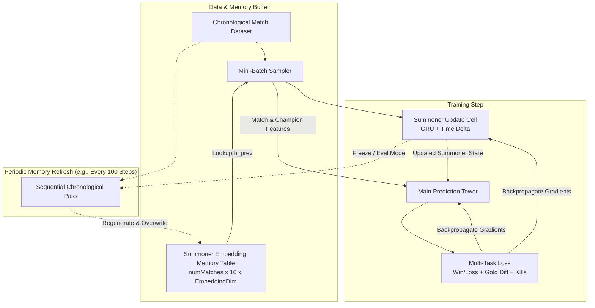
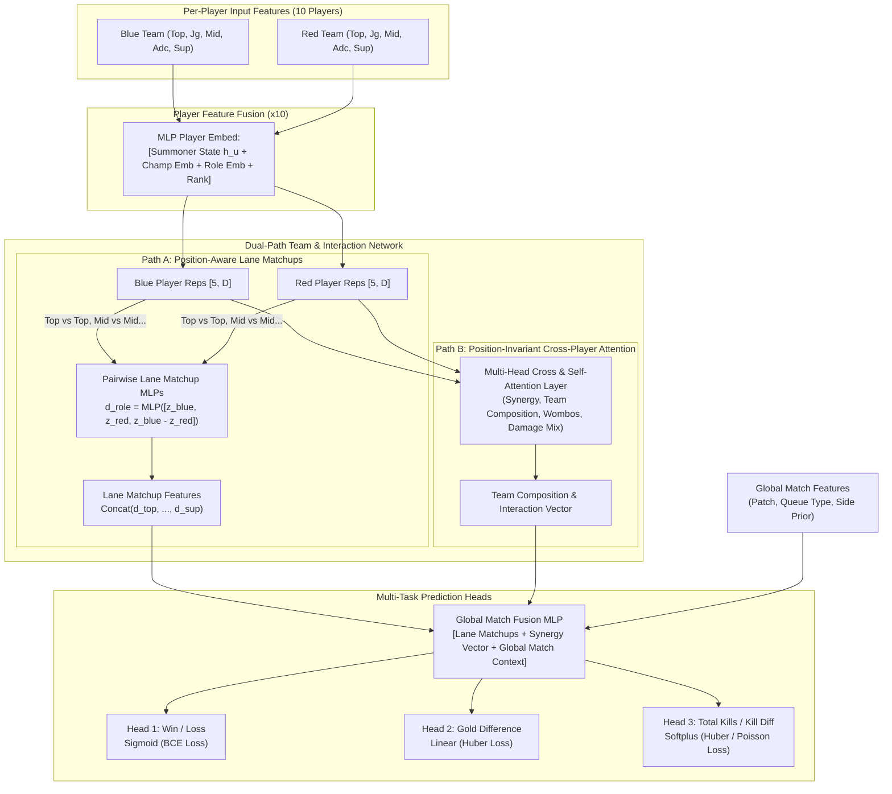

# League of Legends Dynamic Match Prediction Model

## 1. Overview

This document outlines the architecture for a temporal, dynamic graph-inspired ML model designed to predict League of Legends match outcomes. 

Matches are modeled as temporal hyperedges connecting 10 summoners (2 teams of 5 roles). The system consists of two primary modules:
1. **Dynamic Summoner Memory & Update Cell**: A recurrent state model tracking each player's latent form, tilt, champion comfort, and meta-adaptation over time.
2. **Dual-Path Match Prediction Tower**: A neural network combining fixed-position lane matchup analysis and permutation-invariant multi-head attention across players and teams, predicting match outcomes through multi-task learning.

---

## 2. Dynamic Summoner Memory Architecture

### 2.1 State Representation & Initialization
Each summoner $u$ maintains a latent embedding $h_u \in \mathbb{R}^{d_{\text{summoner}}}$.
- **Base State Initialization ($h_u^{(0)}$)**: When a summoner has no recorded prior matches in the sequence, their initial embedding is computed from their baseline summoner features $s_f$:
  $$h_u^{(0)} = \text{FNN}_{\text{init}}(s_f)$$
  Where $s_f$ includes basic summoner attributes available across players:
  - Ranked tier and division (e.g. Diamond II encoded as ordinal/one-hot + LP).
  - Total career matches / account level.
  - Matches played in the current season.
  - Baseline win rate or queue experience (if available).
  - A cold-start / game-count indicator to calibrate model uncertainty.
- **Offline / Stored Memory Buffer**: Stored as a tensor of shape `[numMatches, 10, SummonerEmbeddingDim]`, containing the state snapshot for each of the 10 participants *just prior* to that match (with match 0 for summoner $u$ starting at $h_u^{(0)}$).

### 2.2 Summoner State Update Cell
When summoner $u$ finishes match $t$, their state updates causally based on performance and time elapsed:

$$
h_u^{(t)} = \text{GRUCell}\left(m_u^{(t)},\; h_u^{(t-1)}\right)
$$

Where the message vector $m_u^{(t)}$ is:

$$
m_u^{(t)} = \text{MLP}_{\text{msg}}\Big(\big[\text{Stats}_{\text{prev}}(u),\; \text{TimeDeltaEncoding}(\Delta t),\; \Delta\text{Patch}\big]\Big)
$$

Key inputs to the update cell:
- **Previous Match Stats**: KDA, kill participation, gold share, damage share, vision score, win/loss, champion played.
- **Time Elapsed ($\Delta t$)**: Continuous-time decay embedding ($\log(1 + \Delta t)$ or sinusoidal temporal encoding) capturing rust, momentum, or tilt.
- **Patch Delta**: Indicates whether a major game patch occurred between matches.

---

## 3. Match Prediction Tower Architecture

### 3.1 Per-Player Feature Fusion
For each of the 10 slots $(t, p)$ (team $t \in \{\text{Blue}, \text{Red}\}$, role $p \in \{1..5\}$):

$$
z_{t, p} = \text{MLP}_{\text{player}}\Big(\big[h_u^{(t)},\; \text{Emb}_{\text{champ}}(c),\; \text{Emb}_{\text{role}}(p),\; \text{Features}_{\text{static}}(u)\big]\Big)
$$

### 3.2 Dual-Path Processing

#### Path A: Position-Aware Lane Matchups (Fixed Role Path)
League of Legends has dedicated 1v1 and 2v2 lane assignments. This path directly models matchup advantage for each role:

$$
d_p = \text{MLP}_{\text{lane}}\Big(\big[z_{\text{Blue}, p},\; z_{\text{Red}, p},\; z_{\text{Blue}, p} - z_{\text{Red}, p}\big]\Big) \quad \text{for } p \in \{\text{TOP}, \text{JUNGLE}, \text{MID}, \text{ADC}, \text{SUPPORT}\}
$$

$$
v_{\text{lanes}} = \text{MLP}_{\text{lanes_{agg}}\Big( \text{Concat}(d_{\text{TOP}}, d_{\text{JUNGLE}}, d_{\text{MID}}, d_{\text{ADC}}, d_{\text{SUPPORT}}) \Big)
$$

#### Path B: Position-Invariant Attention (Synergy & Team Composition Path)
Team composition strength transcends fixed lane assignments (e.g. AP/AD damage balance, engage vs. disengage, crowd control chains, dive potential):
- **Multi-Head Self-Attention (Intra-team & Cross-team)**: Computes interaction weights across all 10 players without position bias.
- **Permutation-Equivariant Pooling**: Aggregates Blue and Red composition representations ($T_{\text{Blue}}, T_{\text{Red}}$) using multi-head attention pooling.
- **Team Differential**:

$$
v_{\text{synergy}} = \text{MLP}_{\text{synergy}}\Big(\big[T_{\text{Blue}},\; T_{\text{Red}},\; T_{\text{Blue}} - T_{\text{Red}}\big]\Big)
$$

### 3.3 Global Match Fusion & Multi-Task Heads
The representations from both paths are concatenated with global match context:
$$v_{\text{match}} = \text{MLP}_{\text{fusion}}\Big(\big[v_{\text{lanes}},\; v_{\text{synergy}},\; \text{MLP}_{\text{global}}(\text{MatchFeatures})\big]\Big)$$

#### Output Heads
1. **Match Winner (Classification)**:

$$
\hat{y}_{\text{win}} = \sigma\left(W_{\text{win}} v_{\text{match}} + b_{\text{win}}\right) \quad \longrightarrow \quad \mathcal{L}_{\text{BCE}}(\hat{y}_{\text{win}}, y_{\text{win}})
$$

2. **Gold Difference at Game End (Regression)**:

$$
\hat{y}_{\text{gold}} = W_{\text{gold}} v_{\text{match}} + b_{\text{gold}} \quad \longrightarrow \quad \mathcal{L}_{\text{Huber}}(\hat{y}_{\text{gold}}, y_{\text{gold}})
$$

3. **Total Kills / Kill Differential (Regression)**:

$$
\hat{y}_{\text{kills}} = \text{Softplus}\left(W_{\text{kills}} v_{\text{match}} + b_{\text{kills}}\right) \quad \longrightarrow \quad \mathcal{L}_{\text{Huber}}(\hat{y}_{\text{kills}}, y_{\text{kills}})
$$

**Total Objective**:

$$
\mathcal{L}_{\text{total}} = \mathcal{L}_{\text{BCE}} + \lambda_1 \mathcal{L}_{\text{gold}} + \lambda_2 \mathcal{L}_{\text{kills}}
$$

---

## 4. Training Procedure & Stale-Memory Buffer

To train on dynamic graphs without full Backpropagation Through Time (BPTT) explosions:

1. **Random Mini-Batch SGD**:
   - Sample $B$ random matches uniformly or chronologically from the dataset.
   - Fetch cached summoner prior states $h_u^{(t-1)}$ from memory table `[numMatches, 10, SummonerEmbeddingDim]`.
   - Forward pass through Summoner Update Cell and Main Prediction Tower.
   - Compute $\mathcal{L}_{\text{total}}$ and compute gradients for both the update cell and prediction tower.
2. **Periodic Memory Regeneration (Every $N$ steps, e.g. $N = 100$)**:
   - Set the Summoner Initialization ($\text{FNN}_{\text{init}}$) and Update Cell ($\text{GRU}$) to evaluation mode.
   - Iterate through matches strictly chronologically.
   - For each summoner $u$, start with $h_u^{(0)} = \text{FNN}_{\text{init}}(s_f)$.
   - For each match, record the prior embeddings and compute the next state using the updated cell weights.
   - Overwrite the memory table `[numMatches, 10, SummonerEmbeddingDim]`.

---

## 5. Summary of Design Advantages

| Design Choice | Rationale |
| :--- | :--- |
| **Temporal Dynamic Memory (TGN-style)** | Accurately models player form, streak momentum, and meta adaptation over time without lookahead leakage. |
| **Dual-Path Aggregation** | Combines the inductive bias of fixed 1v1/2v2 lane matchups with position-invariant multi-head attention for team-fight synergy. |
| **Multi-Task Auxiliary Supervision** | Gold difference and kill totals provide dense, continuous gradient signals, stabilizing binary win/loss training. |
| **Decoupled Cached Memory Buffers** | Enables $O(1)$ random batch sampling during gradient descent while retaining sequential graph dynamics. |
