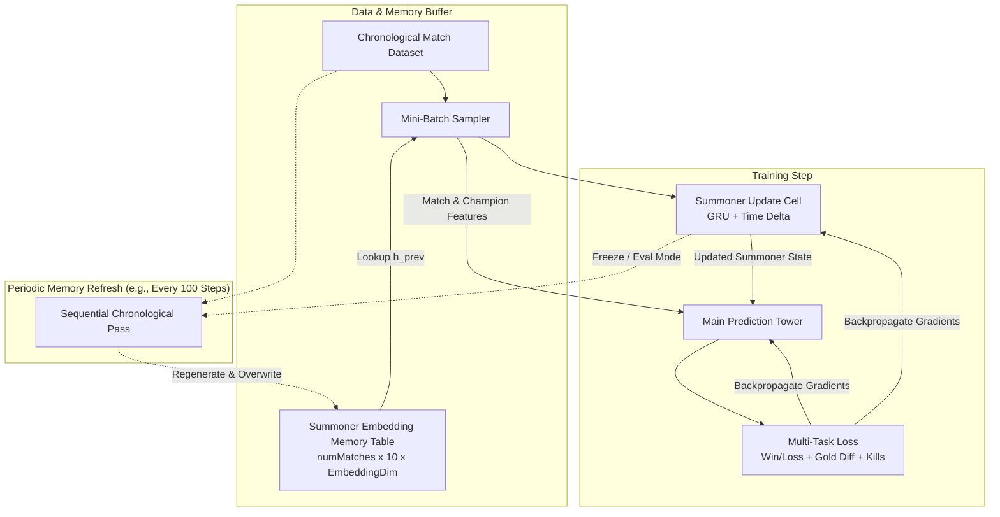
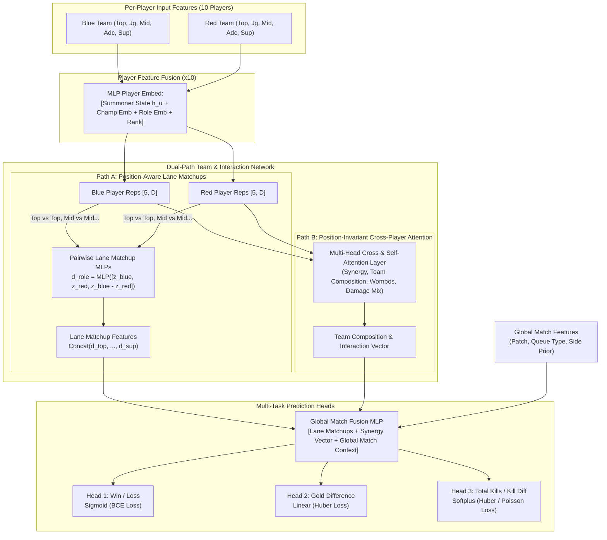

# League of Legends Dynamic Match Prediction Model

## 1. Overview

This document outlines the architecture for a temporal, dynamic graph-inspired ML model designed to predict League of Legends match outcomes. 

Matches are modeled as temporal hyperedges connecting 10 summoners (2 teams of 5 roles). The system consists of two primary modules:
1. **Dynamic Summoner Memory & Update Cell**: A recurrent state model tracking each player's latent form, tilt, champion comfort, and meta-adaptation over time.
2. **Dual-Path Match Prediction Tower**: A neural network combining fixed-position lane matchup analysis and permutation-invariant multi-head attention across players and teams, predicting match outcomes through multi-task learning.



---

## 2. Dynamic Summoner Memory Architecture

### 2.1 State Representation & Initialization
Each summoner $u$ maintains a latent embedding $h_u \in \mathbb{R}^{d_{\text{summoner}}}$.
- **Base State Initialization ($h_u^{(0)}$)**: When a summoner has no recorded prior matches in the sequence, their initial embedding is computed from their baseline summoner features $s_f$:
  $$h_u^{(0)} = \text{FNN}_{\text{init}}(s_f)$$
  Where $s_f$ includes basic summoner attributes available across players:
  - Ranked tier and division (e.g. Diamond II encoded as ordinal/one-hot + LP).
  - Total career matches / account level.
  - Matches played in the current season.
  - Baseline win rate or queue experience (if available).
  - A cold-start / game-count indicator to calibrate model uncertainty.
- **Offline / Stored Memory Buffer**: Stored as a tensor of shape `[numMatches, 10, SummonerEmbeddingDim]`, containing the state snapshot for each of the 10 participants *just prior* to that match (with match 0 for summoner $u$ starting at $h_u^{(0)}$).

### 2.2 Summoner State Update Cell
When summoner $u$ finishes match $t$, their state updates causally based on performance and time elapsed:

$$
h_u^{(t)} = \text{GRUCell}\left(m_u^{(t)},\; h_u^{(t-1)}\right)
$$

Where the message vector $m_u^{(t)}$ is:

$$
m_u^{(t)} = \text{MLP}_{\text{msg}}\Big(\big[\text{Stats}_{\text{prev}}(u),\; \text{TimeDeltaEncoding}(\Delta t),\; \Delta\text{Patch}\big]\Big)
$$

Key inputs to the update cell:
- **Previous Match Stats**: KDA, kill participation, gold share, damage share, vision score, win/loss, champion played.
- **Time Elapsed ($\Delta t$)**: Continuous-time decay embedding ($\log(1 + \Delta t)$ or sinusoidal temporal encoding) capturing rust, momentum, or tilt.
- **Patch Delta**: Indicates whether a major game patch occurred between matches.

---

## 3. Match Prediction Tower Architecture



### 3.1 Per-Player Feature Fusion
For each of the 10 slots $(t, p)$ (team $t \in \{\text{Blue}, \text{Red}\}$, role $p \in \{1..5\}$):

$$
z_{t, p} = \text{MLP}_{\text{player}}\Big(\big[h_u^{(t)},\; \text{Emb}_{\text{champ}}(c),\; \text{Emb}_{\text{role}}(p),\; \text{Features}_{\text{static}}(u)\big]\Big)
$$

### 3.2 Dual-Path Processing

#### Path A: Position-Aware Lane Matchups (Fixed Role Path)
League of Legends has dedicated 1v1 and 2v2 lane assignments. This path directly models matchup advantage for each role:

$$
d_p = \text{MLP}_{\text{lane}}\Big(\big[z_{\text{Blue}, p},\; z_{\text{Red}, p},\; z_{\text{Blue}, p} - z_{\text{Red}, p}\big]\Big) \quad \text{for } p \in \{\text{TOP}, \text{JUNGLE}, \text{MID}, \text{ADC}, \text{SUPPORT}\}
$$

$$
v_{\text{lanes}} = \text{MLP}_{\text{lanes_{agg}}\Big( \text{Concat}(d_{\text{TOP}}, d_{\text{JUNGLE}}, d_{\text{MID}}, d_{\text{ADC}}, d_{\text{SUPPORT}}) \Big)
$$

#### Path B: Position-Invariant Attention (Synergy & Team Composition Path)
Team composition strength transcends fixed lane assignments (e.g. AP/AD damage balance, engage vs. disengage, crowd control chains, dive potential):
- **Multi-Head Self-Attention (Intra-team & Cross-team)**: Computes interaction weights across all 10 players without position bias.
- **Permutation-Equivariant Pooling**: Aggregates Blue and Red composition representations ($T_{\text{Blue}}, T_{\text{Red}}$) using multi-head attention pooling.
- **Team Differential**:

$$
v_{\text{synergy}} = \text{MLP}_{\text{synergy}}\Big(\big[T_{\text{Blue}},\; T_{\text{Red}},\; T_{\text{Blue}} - T_{\text{Red}}\big]\Big)
$$

### 3.3 Global Match Fusion & Multi-Task Heads
The representations from both paths are concatenated with global match context:
$$v_{\text{match}} = \text{MLP}_{\text{fusion}}\Big(\big[v_{\text{lanes}},\; v_{\text{synergy}},\; \text{MLP}_{\text{global}}(\text{MatchFeatures})\big]\Big)$$

#### Output Heads
1. **Match Winner (Classification)**:

$$
\hat{y}_{\text{win}} = \sigma\left(W_{\text{win}} v_{\text{match}} + b_{\text{win}}\right) \quad \longrightarrow \quad \mathcal{L}_{\text{BCE}}(\hat{y}_{\text{win}}, y_{\text{win}})
$$

2. **Gold Difference at Game End (Regression)**:

$$
\hat{y}_{\text{gold}} = W_{\text{gold}} v_{\text{match}} + b_{\text{gold}} \quad \longrightarrow \quad \mathcal{L}_{\text{Huber}}(\hat{y}_{\text{gold}}, y_{\text{gold}})
$$

3. **Total Kills / Kill Differential (Regression)**:

$$
\hat{y}_{\text{kills}} = \text{Softplus}\left(W_{\text{kills}} v_{\text{match}} + b_{\text{kills}}\right) \quad \longrightarrow \quad \mathcal{L}_{\text{Huber}}(\hat{y}_{\text{kills}}, y_{\text{kills}})
$$

**Total Objective**:

$$
\mathcal{L}_{\text{total}} = \mathcal{L}_{\text{BCE}} + \lambda_1 \mathcal{L}_{\text{gold}} + \lambda_2 \mathcal{L}_{\text{kills}}
$$

---

## 4. Data Pipeline, Batch Sampler & Feature Specifications

The Go dataset implementation (`data.Dataset` and `data.MatchSampler`) integrates directly with the GoMLX machine learning library via the `train.Dataset` interface (`github.com/gomlx/gomlx/ml/train`).

### 4.1 Match Sampler (`data.MatchSampler` & `data.SamplerOptions`)

The sampler handles batch construction, temporal window filtering, and curriculum learning probability weighting:

```go
type SamplerOptions struct {
    Name           string                                                         // Dataset identifier for GoMLX
    BatchSize      int                                                            // Matches per batch (default: 32)
    StartTime      time.Time                                                      // Filter: Time() >= StartTime
    EndTime        time.Time                                                      // Filter: Time() < EndTime
    RandomSampling bool                                                           // true = random sampling w/ replacement; false = sequential 1-epoch
    TimeWeight     float64                                                        // 0.0 = heavy early bias -> 1.0 = uniform random
    Infinite       *bool                                                          // true = infinite loop (default for random)
    RandSeed       int64                                                          // Seed for reproducible sampling
    Filter         func(m *MatchV5) bool                                          // Optional match predicate
    BatchBuilder   func(m []*MatchV5) ([]*tensors.Tensor, []*tensors.Tensor, error) // Optional custom tensor builder
    Spec           any                                                            // Task/batch spec passed to train.Batch.Spec
}
```

#### Sampling Modes
1. **Random Sampling with Temporal Bias (`RandomSampling: true`)**:
   - Matches are sampled with replacement using a cumulative probability distribution parameterized by `TimeWeight` $w \in [0.0, 1.0]$:
     $$W_k = \exp\Big(-\alpha \cdot (1.0 - w) \cdot \tau_k\Big) \quad \text{where } \alpha = 4.0, \; \tau_k = \frac{t_k - t_0}{t_{\max} - t_0} \in [0.0, 1.0]$$
   - **$w = 0.0$ (Early Biased)**: Earliest matches receive $\sim 55\times$ higher probability density than latest matches, stabilizing summoner embedding initialization during early training.
   - **$w = 1.0$ (Uniform)**: $W_k = 1.0$ for all matches, sampling uniformly across the time window.
   - Default mode loops indefinitely (`Infinite: true`), yielding batches continuously for SGD training.
2. **Chronological Sequential Iteration (`RandomSampling: false`)**:
   - Iterates through the filtered matches strictly chronologically for exactly one epoch.
   - Used for model evaluation (validation/test sets) and periodic sequential memory buffer regeneration passes.
3. **Train / Validation / Test Splitting**:
   - `StartTime` and `EndTime` define half-open intervals $[t_{\text{start}}, t_{\text{end}})$. For a 7-day dataset:
     - **Train**: Days 1–5 (`StartTime = Day1, EndTime = Day6, RandomSampling = true, TimeWeight = 0.0..1.0`)
     - **Validation**: Day 6 (`StartTime = Day6, EndTime = Day7, RandomSampling = false`)
     - **Test**: Day 7 (`StartTime = Day7, EndTime = Day8, RandomSampling = false`)

---

### 4.2 Standardized Participant Slots

Each match standardizes its 10 participant slots in a deterministic order across two teams of 5 fixed positions:

| Slot Index | Team / Side | Position / Role | Position Enum |
| :---: | :---: | :---: | :---: |
| **0** | Blue Side (`side = 0`) | Top Lane | `PositionTop` (1) |
| **1** | Blue Side (`side = 0`) | Jungle | `PositionJungle` (2) |
| **2** | Blue Side (`side = 0`) | Middle Lane | `PositionMid` (3) |
| **3** | Blue Side (`side = 0`) | Bottom Lane (ADC) | `PositionBot` (4) |
| **4** | Blue Side (`side = 0`) | Support | `PositionSupport` (5) |
| **5** | Red Side (`side = 1`) | Top Lane | `PositionTop` (1) |
| **6** | Red Side (`side = 1`) | Jungle | `PositionJungle` (2) |
| **7** | Red Side (`side = 1`) | Middle Lane | `PositionMid` (3) |
| **8** | Red Side (`side = 1`) | Bottom Lane (ADC) | `PositionBot` (4) |
| **9** | Red Side (`side = 1`) | Support | `PositionSupport` (5) |

---

### 4.3 GoMLX Batch Tensor Layout

The default batch builder (`Dataset.DefaultBatchBuilder`) emits 6 input tensors and 4 label tensors per batch of size $B$:

#### Input Tensors (`train.Batch.Inputs`)

| Tensor | Name | Shape | DType | Description |
| :--- | :--- | :--- | :--- | :--- |
| **`Inputs[0]`** | **Champion IDs** | `[B, 2, 5]` | `Int32` | Champion ID per side (0=Blue, 1=Red) and role (0..4: Top..Support). |
| **`Inputs[1]`** | **Summoner Indices** | `[B, 2, 5]` | `Int32` | Player index in `Dataset.Summoners` (`-1` if unknown/unindexed). |
| **`Inputs[2]`** | **Prior Summoner Embeddings ($h_u^{(t-2)}$)** | `[B, 10, EmbeddingDim]` | `Float32` | Latent embedding snapshot from the summoner's match **2 matches before** current match $t$. All zeros if $<2$ prior matches. |
| **`Inputs[3]`** | **Previous Match Data ($m_{t-1}$)** | `[B, 10, 36]` | `Float32` | Labels and participation statistics from the summoner's **previous match ($t-1$)**, used as input to the Summoner Update Cell. |
| **`Inputs[4]`** | **Match Global Features** | `[B, 4]` | `Float32` | Global match metadata: `[QueueID, MapID, GameDurationSec, PatchNumber]`. |
| **`Inputs[5]`** | **Match Indices** | `[B]` | `Int32` | Index of the current match within `Dataset.Matches` (`-1` if unindexed). |

#### Previous Match Feature Vector (`Inputs[3]`, Dimension = 36)

For each participant slot $s \in [0..9]$, `Inputs[3][b, s, :]` contains:

```
Index   Feature Name             Type/Unit      Description
-------------------------------------------------------------------------------------------------------
 [0]    PrevFeatMatchWon         0.0 / 1.0      1.0 if player won match t-1, 0.0 if lost
 [1]    PrevFeatBlueWon          0.0 / 1.0      1.0 if Blue won match t-1, 0.0 if Red won
 [2]    PrevFeatTeamGoldDiff     Float (Gold)   Player's team gold - opponent team gold in match t-1
 [3]    PrevFeatTeamKillDiff     Float (Kills)  Player's team kills - opponent team kills in match t-1
 [4]    PrevFeatTotalKills       Float (Kills)  Total kills by both teams in match t-1
 [5]    PrevFeatGameDuration     Float (Sec)    Match duration of match t-1
 [6]    PrevFeatChampionID       Float (ID)     Champion ID played in match t-1
 [7]    PrevFeatPosition         Float (Enum)   Position played in match t-1 (1=Top..5=Support)
 [8]    PrevFeatKills            Float (Count)  Kills scored in match t-1
 [9]    PrevFeatDeaths           Float (Count)  Deaths in match t-1
[10]    PrevFeatAssists          Float (Count)  Assists in match t-1
[11]    PrevFeatKDARatio         Float (Ratio)  (Kills + Assists) / max(1, Deaths) in match t-1
[12]    PrevFeatKillPart         0.0 - 1.0      Kill participation percentage in match t-1
[13]    PrevFeatDmgToChamps      Float (Dmg)    Damage dealt to enemy champions in match t-1
[14]    PrevFeatDmgShare         0.0 - 1.0      Team damage share in match t-1
[15]    PrevFeatDmgTaken         Float (Dmg)    Total damage taken in match t-1
[16]    PrevFeatDmgMitigated     Float (Dmg)    Damage self-mitigated in match t-1
[17]    PrevFeatDmgToTurrets     Float (Dmg)    Damage dealt to turrets/buildings in match t-1
[18]    PrevFeatTotalCS          Float (CS)     Total minions and monsters killed in match t-1
[19]    PrevFeatCSPM             Float (Rate)   Creep score per minute in match t-1
[20]    PrevFeatGoldEarned       Float (Gold)   Total gold earned in match t-1
[21]    PrevFeatGPM              Float (Rate)   Gold earned per minute in match t-1
[22]    PrevFeatGoldShare        0.0 - 1.0      Team gold share in match t-1
[23]    PrevFeatVisionScore      Float (Score)  Vision score in match t-1
[24]    PrevFeatVSPM             Float (Rate)   Vision score per minute in match t-1
[25]    PrevFeatWardsPlaced      Float (Count)  Wards placed in match t-1
[26]    PrevFeatWardsKilled      Float (Count)  Enemy wards destroyed in match t-1
[27]    PrevFeatControlWards     Float (Count)  Control wards placed/bought in match t-1
[28]    PrevFeatFirstBlood       0.0 / 1.0      1.0 if player scored first blood kill in match t-1
[29]    PrevFeatFirstBloodAst    0.0 / 1.0      1.0 if player got first blood assist in match t-1
[30]    PrevFeatFirstTower       0.0 / 1.0      1.0 if player got first tower takedown in match t-1
[31]    PrevFeatTimeDeltaHours   Float (Hours)  Elapsed time Δt between match t-1 and current match t
[32]    PrevFeatPatchDelta       Float (Delta)  Game patch difference (Patch_t - Patch_{t-1})
[33]    PrevFeatCareerMatches    Float (Count)  Total matches played by summoner prior to match t
[34]    PrevFeatCareerWinRate    0.0 - 1.0      Historical win rate across all matches prior to match t
[35]    PrevFeatIsColdStart      0.0 / 1.0      1.0 if summoner has 0 prior recorded matches (cold start)
```

#### Label Tensors (`train.Batch.Labels`)

| Tensor | Name | Shape | DType | Target / Loss Function |
| :--- | :--- | :--- | :--- | :--- |
| **`Labels[0]`** | **Match Winner** | `[B, 1]` | `Float32` | Binary classification: `1.0` if Blue won, `0.0` if Red won ($\mathcal{L}_{\text{BCE}}$). |
| **`Labels[1]`** | **Gold Difference** | `[B, 1]` | `Float32` | Regression: Blue Total Gold - Red Total Gold ($\mathcal{L}_{\text{Huber}}$). |
| **`Labels[2]`** | **Kill Difference** | `[B, 1]` | `Float32` | Regression: Blue Total Kills - Red Total Kills ($\mathcal{L}_{\text{Huber}}$). |
| **`Labels[3]`** | **Total Kills** | `[B, 1]` | `Float32` | Auxiliary Regression: Blue Total Kills + Red Total Kills ($\mathcal{L}_{\text{Huber}}$). |

---

### 4.4 End-to-End Step Computation Flow

```
Inputs[2]: Prior Embeddings h_u^(t-2) [B, 10, D] ──┐
                                                  ├──> [Summoner Update Cell] ──> Updated State h_u^(t-1) [B, 10, D]
Inputs[3]: Previous Match Data (t-1)  [B, 10, 36] ──┘                                      │
                                                                                           ▼
Inputs[0]: Champion IDs [B, 2, 5] ─────────────────────────────────────────────> [Main Prediction Tower]
Inputs[1]: Summoner IDs [B, 2, 5] ─────────────────────────────────────────────>           │
Inputs[4]: Global Features [B, 4] ─────────────────────────────────────────────>           │
                                                                                           ▼
                                                                                 [Multi-Task Output Heads]
                                                                                           │
                                                          ┌────────────────────────────────┼────────────────────────────────┐
                                                          ▼                                ▼                                ▼
                                                  Win/Loss [B, 1]                  Gold Diff [B, 1]                 Kill Diff [B, 1]
                                                  vs. Labels[0]                    vs. Labels[1]                    vs. Labels[2]
```

---

## 5. Training Procedure & Stale-Memory Buffer

To train on dynamic graphs without full Backpropagation Through Time (BPTT) explosions:

1. **Random Mini-Batch SGD**:
   - Sample $B$ random matches using `MatchSampler` with temporal weight $w \in [0.0, 1.0]$.
   - `Inputs[2]` supplies cached summoner states $h_u^{(t-2)}$ from the transient memory table `[NumMatches, 10, SummonerEmbeddingDim]`.
   - `Inputs[3]` supplies previous match outcome & performance metrics $m_{t-1}$.
   - The Summoner Update Cell computes $h_u^{(t-1)} = \text{GRUCell}(m_{t-1}, h_u^{(t-2)})$.
   - The Main Prediction Tower consumes $h_u^{(t-1)}$, `Inputs[0]` (Champions), `Inputs[1]` (Summoners), and `Inputs[4]` (Globals) to compute predictions.
   - Gradients flow back through both the Main Prediction Tower and the Summoner Update Cell simultaneously.
2. **Periodic Memory Regeneration (Every $N$ steps, e.g. $N = 100$)**:
   - Set the Summoner Initialization ($\text{FNN}_{\text{init}}$) and Update Cell ($\text{GRU}$) to evaluation mode.
   - Run a sequential pass using `MatchSampler` with `RandomSampling: false` across the dataset chronologically.
   - For each summoner $u$, start at $h_u^{(0)} = \text{FNN}_{\text{init}}(s_f)$.
   - For each match, compute the next state using the updated cell weights and overwrite `Dataset.SummonerEmbeddings`.

---

## 6. Summary of Design Advantages

| Design Choice | Rationale |
| :--- | :--- |
| **Temporal Dynamic Memory (TGN-style)** | Accurately models player form, streak momentum, and meta adaptation over time without lookahead leakage. |
| **Dual-Path Aggregation** | Combines the inductive bias of fixed 1v1/2v2 lane matchups with position-invariant multi-head attention for team-fight synergy. |
| **Multi-Task Auxiliary Supervision** | Gold difference and kill totals provide dense, continuous gradient signals, stabilizing binary win/loss training. |
| **Decoupled Cached Memory Buffers** | Enables $O(1)$ random batch sampling during gradient descent while retaining sequential graph dynamics. |
| **Standardized [B, 2, 5] Slot Topology** | Removes redundant position/side tensor inputs while preserving lane alignment and team separation. |
